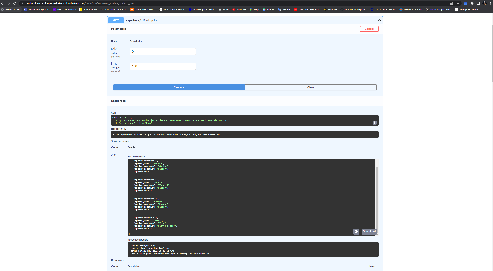

# Basisproject API
Voor dit project heb ik gekozen om een API te maken die kan dienen voor het maken van een spelerslijst voor een voetbalploeg. 
Ik heb gebruik gemaakt van een databank voor mijn data op te slagen en deze later uit op te vragen. 
In mijn API kan je dus uiteraard verschillende spelers toevoegen aan deze databank en je kan deze later aan de hand van de ID terug opvragen. 
Het is ook mogelijk om alle spelers tegelijk weer te geven. 
Als extra heb ik ervoor gekozen om de mogelijkheid te voorzien om een speler aan de hand van zijn ID te verwijderen uit de database. 
Ik heb er in deze API voor gekozen om dit allemaal uit te werken rond de voetbalploeg KV Mechelen.
Ik ben er jammer genoeg niet in geslaagd om een volledig werkende front-end te maken.

## Informatie
* GitHub repository voor de API: https://github.com/jentelliekens/API_Project 
* Github repository voor de front-end: https://github.com/jentelliekens/API_Front 
* Hosted API link: https://randomizer-service-jentelliekens.cloud.okteto.net
* Hosted front-end link: https://jentelliekens.sinners.be/ 

    - Python 3+ / FastApi / Uvicorn / aiohttp
    - Postgres / SqlAlchemy(ORM) / Alembic(Migrations) / psycopg2(db Driver)

## Screenshots OpenAPI docs
* Overzicht van alle opties 
* Het toevoegen van een speler aan de database 
* Het weergeven van alle spelers uit de database 
* Het weergeven van één speler uit de database op basis van zijn ID 
* Het verwijderen van één speler uit de database op basis van zijn ID   

## Screenshots Postman
* Opvragen van alle spelers via Postman 
* Opvragen van een individule speler via Postman 
* Toevoegen van een speler via Postman 